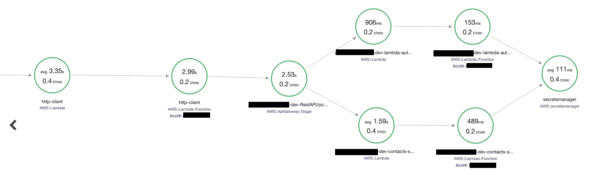

# Amazon Aurora HTTP Client

Amazon Aurora HTTP Client is a solution that adds an HTTP Client for Amazon Aurora MySQL-Compatible Edition and Amazon Aurora PostgreSQL-Compatible Edition. The solution uses the integration of Amazon Aurora and AWS Lambda. For the HTTP Client function, this solution uses the Node.js platform.

The primary use case for Aurora Lambda HTTP Client is to help customers who are looking for an alternative for [Oracle UTL_HTTP](https://docs.oracle.com/database/121/ARPLS/u_http.htm#ARPLS070) when migrating from Oracle to Aurora.

## How to use this project

Amazon Aurora HTTP Client is implemented as a Node.js Lambda function. Amazon Aurora invokes this function and passes the following input parameters: endpoint URL, request type, request headers, and request body. The Lambda function then makes the HTTP request and sends the HTTP response back to Aurora.

We recommend that you integrate the deployment of this function into your CI/CD pipeline and automate this process with such tools as [AWS CDK](https://aws.amazon.com/cdk/).

The following example shows the deployment of Aurora Lambda HTTP Client with [AWS CLI](https://aws.amazon.com/cli/):

```bash
AWS_ACCOUNT_ID=$(aws sts get-caller-identity --query "Account" --output text)
# install only production dependencies
npm install --omit=dev
# zip function code and its dependencies
zip -r amazon-aurora-http-client.zip *.js node_modules
# create IAM role and attach policies
aws iam create-role --role-name amazon-aurora-http-client-role --assume-role-policy-document '{"Version": "2012-10-17","Statement": [{ "Effect": "Allow", "Principal": {"Service": "lambda.amazonaws.com"}, "Action": "sts:AssumeRole"}]}'
aws iam attach-role-policy --role-name amazon-aurora-http-client-role --policy-arn arn:aws:iam::aws:policy/service-role/AWSLambdaBasicExecutionRole
aws iam attach-role-policy --role-name amazon-aurora-http-client-role --policy-arn arn:aws:iam::aws:policy/AWSXRayDaemonWriteAccess
# create function
aws lambda create-function \
    --function-name amazon-aurora-http-client \
    --runtime nodejs18.x \
    --tracing-config Mode=Active \
    --zip-file fileb://amazon-aurora-http-client.zip \
    --handler index.handler \
    --role arn:aws:iam::${AWS_ACCOUNT_ID}:role/amazon-aurora-http-client-role
```

## Lambda function API

After you deploy the Lambda function, you can use AWS Lambda Console to test it.

### Input

The following code example shows all supported parameters:

```json
{
    "url": "https://checkip.amazonaws.com/",
    "requestType": "POST",
    "headers": {
        "Accept-Encoding": "application/json",
        "Accept-Language": "en-US,en;q=0.7,es;q=0.3"
    },
    "body": {
        "this": ["is", "a", "test"]
    }
}
```

In the preceding example, the `headers` and `body` parameters are optional. The following code example shows a simple `GET` request.

```json
{
    "url": "https://checkip.amazonaws.com/",
    "requestType": "GET"
}
```

### Output

The output of the Lambda function is a JSON object:

```json
{
    "statusCode": 200,
    "statusMessage": "OK",
    "headers": {
        "date": "Thu, 10 Nov 2022 08:59:17 GMT",
        "content-type": "application/json; charset=utf-8",
        "content-length": "134"
    },
    "body": [
        { "id": 1, "title": "Post 1" },
        { "id": 2, "title": "Post 2" },
        { "id": 3, "title": "Post 3" }
    ]
}
```

> Note: if the response content type is JSON, the `body` field is returned as a JSON object, otherwise it is returned as a string.

## Invoking Aurora Lambda HTTP Client from Aurora

After Lambda function is deployed, follow [Invoking a Lambda function with an Aurora MySQL native function](https://docs.aws.amazon.com/AmazonRDS/latest/AuroraUserGuide/AuroraMySQL.Integrating.Lambda.html#AuroraMySQL.Integrating.NativeLambda) for Aurora MySQL or [Invoking an AWS Lambda function from an Aurora PostgreSQL DB cluster](https://docs.aws.amazon.com/AmazonRDS/latest/AuroraUserGuide/PostgreSQL-Lambda.html) for Aurora PostgreSQL, to enable and setup Lambda integration in your cluster.

For Aurora PostgreSQL, run the following code to create a function which invokes the HTTP Client Lambda solution:

```sql
-- create required AWS extensions
CREATE EXTENSION IF NOT EXISTS aws_commons;
CREATE EXTENSION IF NOT EXISTS aws_lambda;

CREATE OR REPLACE FUNCTION http_client(IN p_endpoint TEXT, IN p_request_type CHARACTER VARYING(10), IN p_headers JSON, IN p_body TEXT)
RETURNS TEXT
LANGUAGE plpgsql
AS
$BODY$
DECLARE
    /* Lambda HTTP Client function name and region */
    LAMBDA_NAME               CONSTANT CHARACTER VARYING(25) := 'amazon-aurora-http-client';
    LAMBDA_REGION             CONSTANT CHARACTER VARYING(15) := 'eu-central-1';

    /* Request */
    request_json JSON;

    /* Response */
    lambda_response_code INTEGER;
    external_endpoint_response_code INTEGER;
    lambda_response_payload JSON;
    response TEXT;

    /* Errors */
    lambda_function_error CHARACTER VARYING(20) := 'Lambda Error';
    external_endpoint_error CHARACTER VARYING(30) := 'External Endpoint Error';
BEGIN

    /* Build the request object */
    request_json := json_build_object(
        'url', p_endpoint,
        'payload', p_body,
        'headers', p_headers,
        'requestType', p_request_type
    );

    /* Get the results */
    SELECT
        status_code,
        payload->'statusCode',
        payload->'body'::TEXT
    INTO
        lambda_response_code,
        external_endpoint_response_code,
        response
    FROM aws_lambda.invoke(
        aws_commons.create_lambda_function_arn(LAMBDA_NAME, LAMBDA_REGION),
        request_json
    );

    /* Check basic errors */
    IF lambda_response_code != 200 THEN
        RAISE USING detail = lambda_function_error;
    END IF;

    IF external_endpoint_response_code IS NOT NULL AND external_endpoint_response_code != 200 THEN
        RAISE USING detail = external_endpoint_error;
    END IF;

    /* Return response to the user */
    RETURN response;

END;
$BODY$;

-- example of an invocation of the http_call function
SELECT * FROM http_client(
    'https://checkip.amazonaws.com',
    'POST',
    jsonb_build_object('Content-Type', 'application/x-www-form-urlencoded')::JSON,
    'form_encoded_body=example');
```

## AWS X-Ray integration

This project uses [AWS X-Ray SDK for Node.js](https://docs.aws.amazon.com/xray/latest/devguide/xray-sdk-nodejs.html) to instrument HTTPS calls. These calls are automatically added to the X-Ray service graph.

For example, if the Amazon Aurora HTTP Client invokes Amazon API Gateway, which invokes other Lambda functions or AWS services, X-Ray captures them as downstream services:



## Security

See [CONTRIBUTING](CONTRIBUTING.md#security-issue-notifications) for more information.

## License

This library is licensed under the MIT-0 License. See the LICENSE file.
